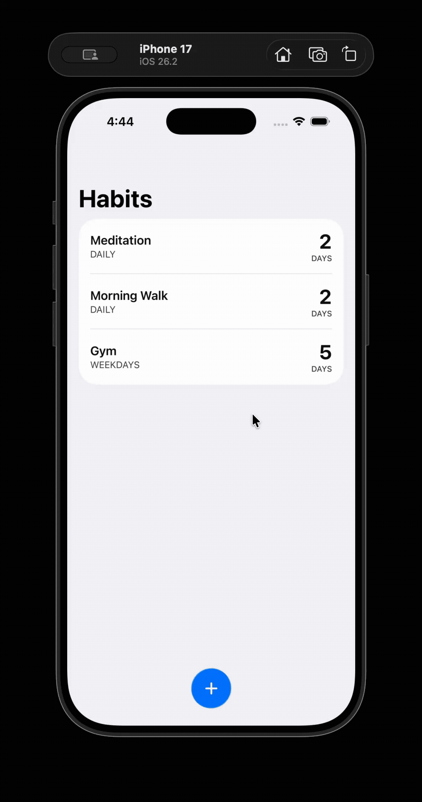

# expo-ui-swipe-actions

Native SwiftUI `swipeActions` modifier for [Expo UI](https://docs.expo.dev/versions/latest/sdk/ui/) components.

> iOS only — requires Expo SDK 52+ and `@expo/ui` 0.9+

> [!IMPORTANT]
> This modifier relies on the native SwiftUI `swipeActions` API, which **only works inside a `List`**. Applying it to views inside a `ScrollView`, `VStack`, or any other container will have no effect, the modifier is silently ignored by SwiftUI.

## Demo



## Installation

```bash
npm install expo-ui-swipe-actions
```

## Usage

```tsx
import { swipeActions } from "expo-ui-swipe-actions";
import { List, HStack } from "@expo/ui/swift-ui";

<List>
  <HStack
    alignment="center"
    modifiers={[
      swipeActions({
        leading: [
          {
            id: "pin",
            label: "Pin",
            systemImage: "pin.fill",
            tint: "#FF9500",
            onPress: () => console.log("pin"),
          },
        ],
        trailing: [
          {
            id: "delete",
            label: "Delete",
            systemImage: "trash",
            tint: "#FF3B30",
            role: "destructive",
            onPress: () => console.log("deleted"),
          },
          {
            id: "edit",
            label: "Edit",
            systemImage: "pencil",
            tint: "#0A84FF",
            onPress: () => console.log("edited"),
          },
        ],
        allowsFullSwipe: false,
      }),
    ]}
  >
    {/* your content */}
  </HStack>
</List>;
```

## API

### `swipeActions(params)`

| Param             | Type                  | Default | Description                               |
| ----------------- | --------------------- | ------- | ----------------------------------------- |
| `leading`         | `SwipeActionConfig[]` | `[]`    | Actions revealed on left swipe            |
| `trailing`        | `SwipeActionConfig[]` | `[]`    | Actions revealed on right swipe           |
| `allowsFullSwipe` | `boolean`             | `false` | Triggers the first action on a full swipe |

### `SwipeActionConfig`

| Prop          | Type                        | Required | Description                                                   |
| ------------- | --------------------------- | -------- | ------------------------------------------------------------- |
| `id`          | `string`                    | Yes      | Unique identifier for the action                              |
| `label`       | `string`                    | Yes      | Button label text                                             |
| `systemImage` | `string`                    | No       | SF Symbol name (e.g. `"trash"`, `"pencil"`)                   |
| `tint`        | `string`                    | No       | Button color: named color or hex (e.g. `"teal"`, `"#FF3B30"`) |
| `role`        | `"destructive" \| "cancel"` | No       | Applies SwiftUI role styling                                  |
| `onPress`     | `() => void`                | Yes      | Called when the action is tapped                              |
